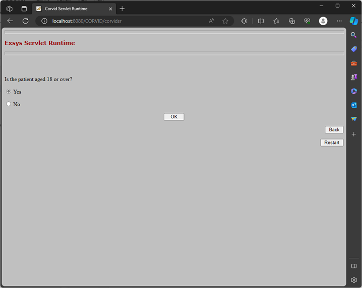
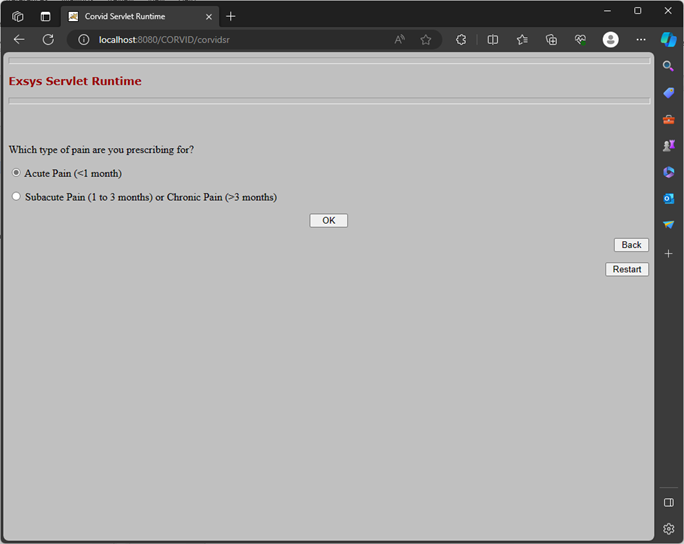
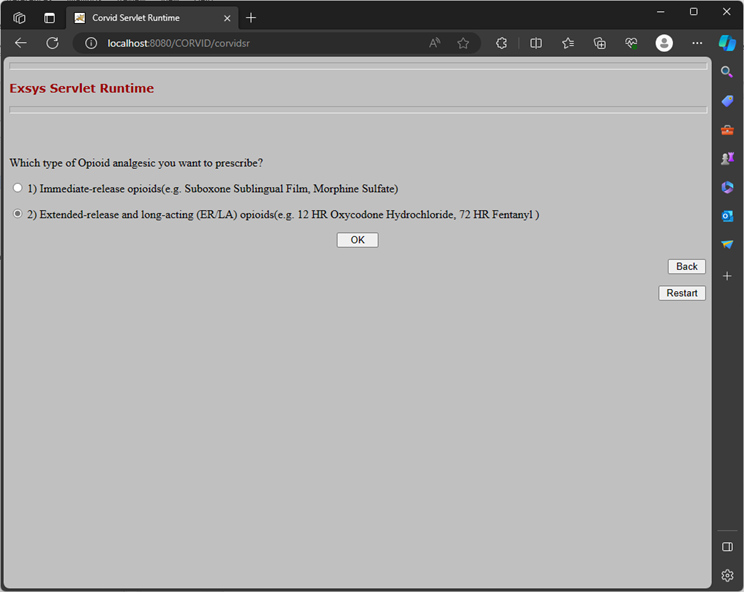
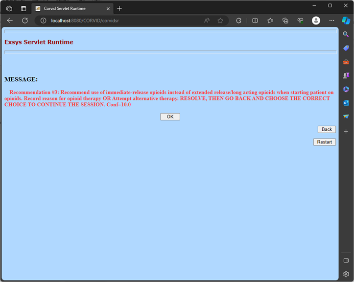
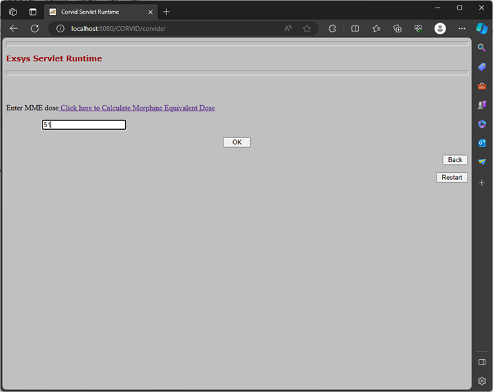
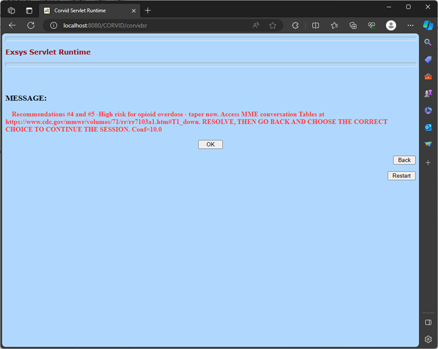
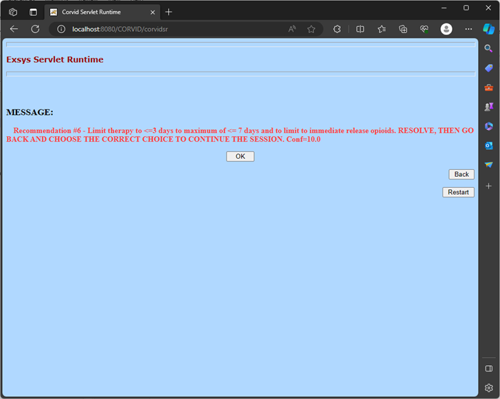
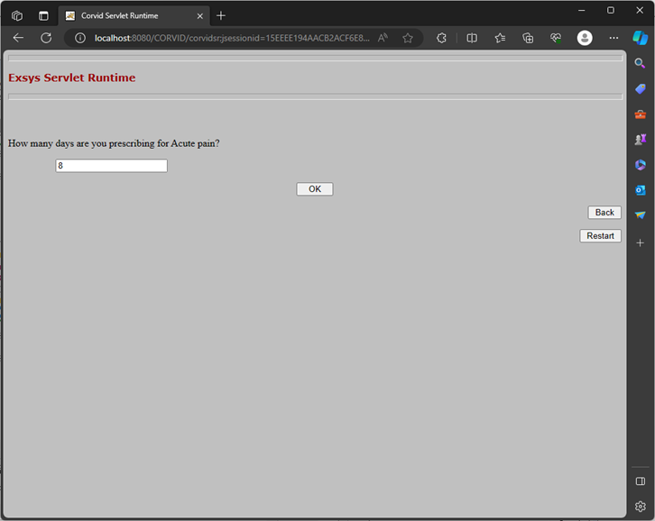
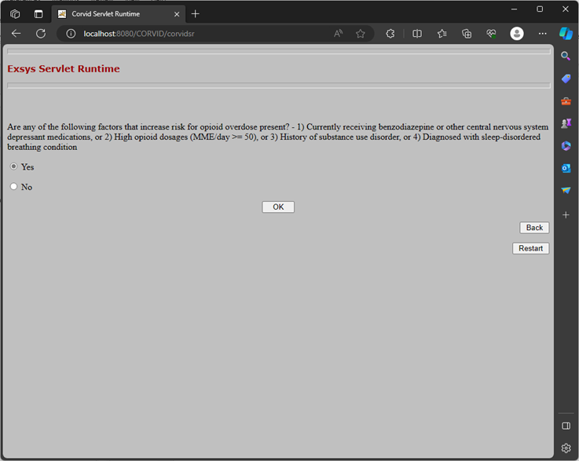
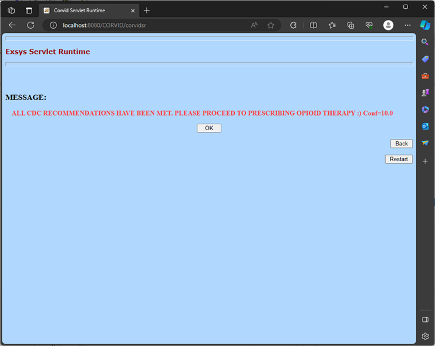

# Opioid Prescription Clinical Decision Support (CDS) System

## Project Overview

This project presents a rule-based Clinical Decision Support System (CDS) developed using Corvid to implement the 2022 CDC Clinical Practice Guidelines for Prescribing Opioids for Pain. The system guides clinicians through evidence-based opioid prescribing workflows using interactive decision trees, recommendations, alerts, and risk mitigation strategies.

The CDS system evaluates prescribing scenarios for acute, subacute, and chronic pain while identifying high-risk opioid prescribing patterns, dosage concerns, benzodiazepine interactions, naloxone recommendations, and opioid misuse considerations.

---

## Background

Opioid overprescribing and opioid-related overdose remain major public health concerns in the United States. The CDC released updated opioid prescribing guidelines in 2022 to improve prescribing safety and reduce unnecessary opioid exposure.

This project demonstrates how clinical guidelines can be translated into an interactive Clinical Decision Support workflow using rule-based healthcare informatics logic.

---

## Key Features

- Rule-based Clinical Decision Support System
- Interactive opioid prescribing workflow
- Acute and chronic pain decision trees
- CDC guideline implementation
- MME (Morphine Milligram Equivalent) dose evaluation
- Naloxone risk mitigation recommendations
- Benzodiazepine interaction alerts
- Prescription duration monitoring
- Opioid misuse disorder recommendations
- Evidence-based prescribing support

---

## Technologies Used

- Corvid Expert System
- Clinical Decision Trees
- Rule-Based Logic
- Healthcare Informatics
- CDC Clinical Practice Guidelines
- CDS Workflow Design

---

## Clinical Decision Support Workflow Screenshots

### A. Outpatient Validation

The system first validates whether the patient is being treated in an outpatient setting.

---

### B. Age Eligibility Check

The CDS workflow confirms whether the patient is 18 years or older before proceeding.

---

### C. Acute Pain Decision Tree

Interactive workflow used to determine acute versus chronic pain management pathways.

---

### D. Recommendation #1 — Nonopioid Therapy

The CDS recommends nonpharmacologic and nonopioid therapies when appropriate.

---

### E. Extended Release Opioid Check

The system evaluates whether extended-release or long-acting opioids are being prescribed.

---

### F. Recommendation #3

The CDS recommends immediate-release opioids instead of extended-release opioids for opioid-naive patients.

---

### G. MME Dose Evaluation

The system evaluates opioid dosage thresholds using Morphine Milligram Equivalent (MME) calculations.

---

### H. High-Risk Dose Recommendation

High-risk opioid dosage scenarios trigger overdose risk and tapering recommendations.

---

### I. Duration Recommendation

The CDS evaluates opioid prescription duration and recommends limiting therapy duration when appropriate.

---

### J. Prescription Duration Validation

Workflow validation for opioid prescription duration monitoring.

---

### K. Additional Recommendation Workflow

Additional prescribing guidance based on duration and opioid usage evaluation.

---

### L. Naloxone Risk Evaluation

The system identifies overdose risk factors and recommends naloxone consideration.

---

### M. Benzodiazepine Interaction Warning

The CDS warns against concurrent opioid and benzodiazepine prescribing.

---

### N. Recommendation #8

Risk mitigation recommendations related to opioid overdose prevention.

---

### O. Final Recommendation Screen

Final evidence-based recommendation output generated by the CDS workflow.

---

## Clinical Logic and Testing

The project includes:
- Rule-based prescribing logic
- Decision-tree workflows
- Recommendation triggers
- Test cases and validation examples
- Clinical scenario evaluation
- CDC guideline mapping

Detailed logic, prompts, rules, and test examples are documented in the included project paper.

---

## Files Included

| File | Description |
|---|---|
| README.md | Project overview and documentation |
| Corvid download.pdf | Clinical decision support project paper |
| screenshots/ | CDS workflow screenshots |
| LICENSE | MIT License |

---

## References

- CDC Clinical Practice Guidelines for Prescribing Opioids for Pain (2022)
- FHIR Opioid CDS Framework:
https://build.fhir.org/ig/cqframework/opioid-cds-r4/

---

## Author

**Divya Verma**

Healthcare Informatics | Clinical Decision Support | NLP Research | Healthcare AI
